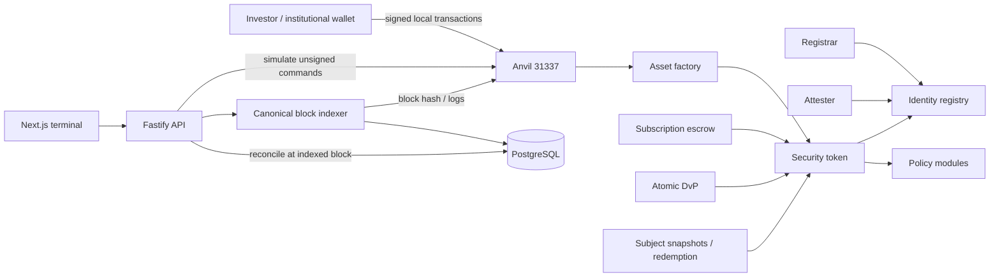

# Atlas RWA architecture

The local reference includes immutable Solidity contracts, a PostgreSQL event ledger, strict TypeScript Fastify API, ethers SDK adapter and Next.js terminal. All amounts are whole security units or six-decimal mock-EUR integers.

Contracts enforce authorization, eligibility and accounting. The API never replaces those checks and holds no private keys. Transaction preparation is not authorization: the real signer must submit. The local demo alone uses Anvil's disposable unlocked accounts, guarded by chain ID 31337.

Persistence uses a dedicated PostgreSQL client and serialized operations. PGlite provides the local embedded PostgreSQL adapter; DATABASE_URL selects a PostgreSQL server. RPC reads are block-tagged for reconciliation. Reorg replay changes the derived ledger; it never sends compensating blockchain transactions.

Identity metadata is synthetic and public. Document hashes are not encryption. No identity documents or sensitive KYC material belong on-chain.

See decisions/ for standard compatibility, governance, precision, settlement, corporate actions and off-chain tradeoffs. The dashboard currently targets one deployed demo suite. Its new-token wizard prepares real factory transactions but does not orchestrate a new multi-contract suite; use the deployment script for that.
